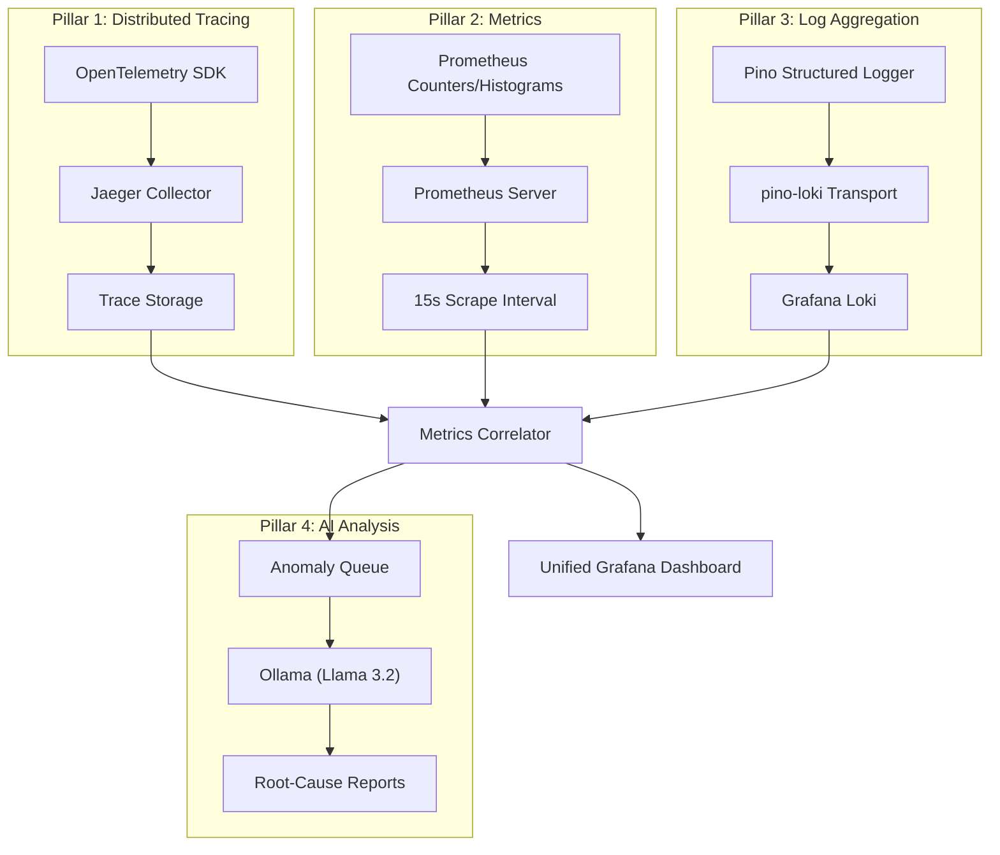
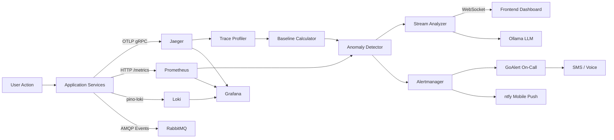
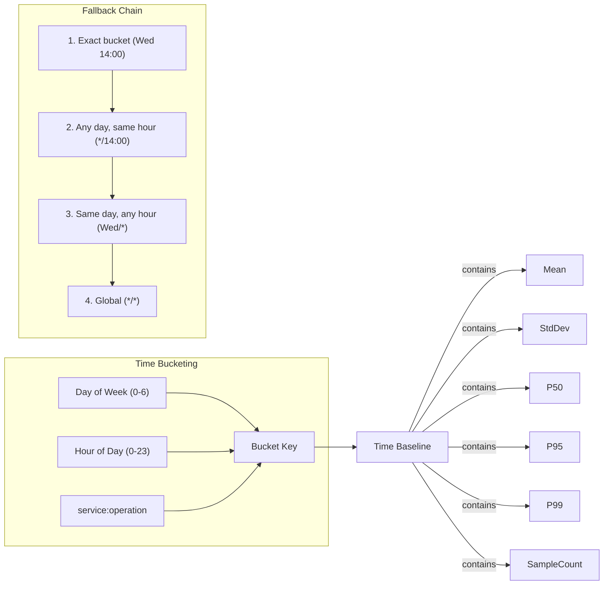
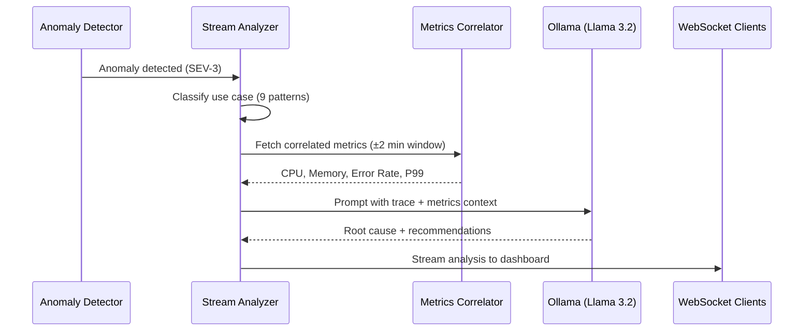
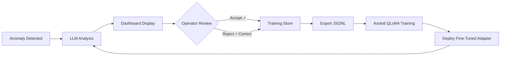
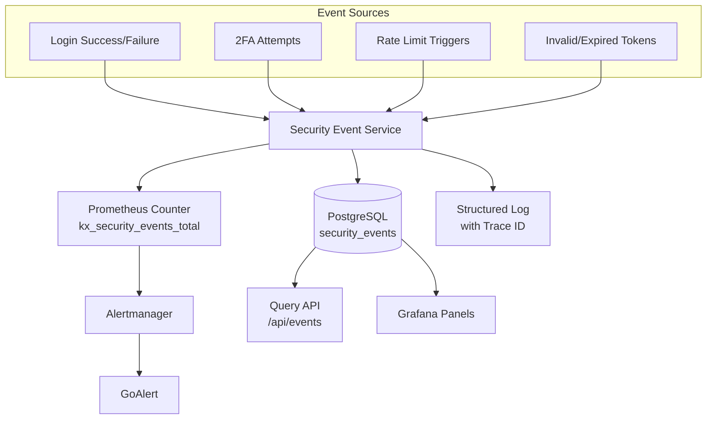
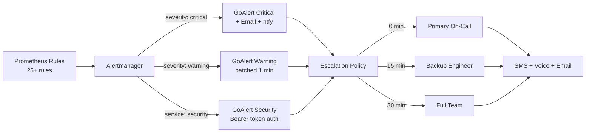
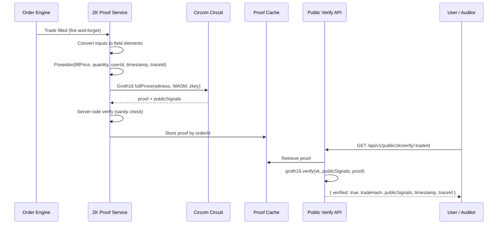

# KrystalineX Unified Observability Platform
### Technical Architecture & Capabilities Overview

**Version:** 2.0  
**Date:** March 6, 2026  
**Classification:** Public  
**Authors:** Carlos Montero & Antigravity (AI Assistant, Google DeepMind)  
**Sessions:**  
- `5dade5d5-ac60-4143-9ee9-97e7d22e1fa7` — v1.0 (Feb 7, 2026)  
- `f0615ab8-927d-47ef-97bf-e1eeb4f812c5` — v2.0 (Mar 6, 2026)  

---

## 1. Executive Summary

KrystalineX is an institutional-grade cryptocurrency exchange observability demo built on a philosophy we call **Proof of Observability™** — the principle that every transaction, every service interaction, and every system decision must be traced, verified, and auditable in real-time.

Unlike traditional exchanges that treat monitoring as an afterthought, KrystalineX embeds observability into its core DNA. Every trade generates a distributed trace spanning 8–15+ microservice operations and a **Groth16 zk-SNARK proof** anchoring execution to its timestamp and OTel trace. Every latency measurement feeds into statistical baselines that power autonomous anomaly detection. Every security event is persisted, correlated, and surfaced through unified dashboards — all without requiring operators to switch between disconnected tools.

The result is an exchange platform that doesn't just *claim* uptime — it **proves** it. Continuously. Cryptographically. In real-time.
This architecture serves as a **scalable template for Unified, Consolidated Observability** — demonstrating how the same patterns can track and trace all operations across an entire organization, from trading to compliance to infrastructure.

**Key metrics:**
- **4 monitored business services** with 32+ tracked operations  
- **2 zk-SNARK circuits** (Groth16/BN128) — trade integrity + solvency  
- **5-tier severity model** (SEV1–SEV5) calibrated to normal distribution percentiles  
- **34 active alert rules** across 9 categories with automated escalation  
- **Sub-second anomaly detection** via Welford's online algorithm  
- **AI-powered root-cause analysis** using LoRA-tuned Llama 3.2:1B (locally hosted)  
- **940+ automated tests** ensuring regression-free deployments  

---

## 2. Platform Introduction

KrystalineX operates as a full-stack BTC/USD exchange platform with the following core services:

| Service | Responsibility | Technology |
|---------|---------------|------------|
| **API Gateway** | Request routing, rate limiting, authentication | Kong Gateway + Node.js |
| **Trading Engine** (`kx-exchange`) | Order lifecycle, wallet management, user accounts | Node.js + PostgreSQL |
| **Order Matcher** (`kx-matcher`) | Order matching, execution, settlement | Node.js + RabbitMQ |
| **Wallet Service** (`kx-wallet`) | Balance management, transfers, deposits/withdrawals | Node.js + PostgreSQL |
| **Payment Processor** | Inter-service settlement via message queue | Node.js + RabbitMQ |

The platform processes trades against a **live Binance WebSocket price feed**, ensuring non-simulated, deterministic pricing. Users interact through an institutional-grade React frontend that surfaces real-time system health, trace-verified activity feeds, and per-operation performance data — directly in the trading interface.


---

## 3. Observability Architecture

### 3.1 Four Pillars of Observability

KrystalineX implements a **four-pillar observability model** that unifies all telemetry signals into a single analysis plane:



### 3.2 End-to-End Data Flow

Every user action (login, trade, transfer) generates telemetry that flows through three distinct pipelines:



### 3.3 Technology Stack

| Layer | Technology | Purpose |
|-------|-----------|---------|
| Instrumentation | OpenTelemetry SDK | Distributed tracing across all services |
| Trace Backend | Jaeger (all-in-one) | Trace collection, storage, and query API |
| Metrics | Prometheus + Node Exporter + PG Exporter | Time-series metrics (app + infra + DB) |
| Log Aggregation | Loki + Promtail | Structured log ingestion and correlation |
| Dashboarding | Grafana | Unified multi-signal visualization |
| Alerting | Alertmanager → GoAlert | Tiered alert routing with on-call scheduling |
| AI Analysis | Ollama (Llama 3.2:1b) | Automated root-cause analysis of anomalies |
| Message Queue | RabbitMQ | Event-driven order processing and settlement |
| Databases | PostgreSQL (x3) | App data, Kong config, GoAlert state |

---

## 4. Statistical Anomaly Detection Engine

The core of KrystalineX's intelligence layer is a **dual-mode statistical anomaly detection engine** that operates in real-time on both latency and transaction amount signals.

### 4.1 Latency Anomaly Detection

The **Trace Profiler** continuously polls the Jaeger API every 30 seconds, collecting spans from all four monitored services. It calculates per-operation baselines using **Welford's online algorithm** — an incremental method that computes mean and variance in a single pass without storing historical values:

```
# Welford's Online Algorithm (as implemented)
For each new observation x:
    count += 1
    delta = x - mean
    mean += delta / count
    delta2 = x - mean
    M2 += delta * delta2
    variance = M2 / count
    stdDev = sqrt(variance)
```

This approach is critical for production systems because:
- **O(1) memory** — no need to store millions of raw data points  
- **Numerically stable** — avoids catastrophic cancellation in variance calculation  
- **Incremental** — baselines refine continuously without batch recomputation  

The **Anomaly Detector** then evaluates each incoming span against its operation baseline using **Z-score deviation**:

```
deviation = (observedDuration - baselineMean) / baselineStdDev
```

Anomalies are classified into a **5-tier severity model** calibrated to the percentiles of a normal distribution:

| Severity | σ Threshold | Percentile | Meaning |
|----------|-------------|------------|---------|
| SEV-5 | >1.3σ | ~80th | Minor variance — monitoring only |
| SEV-4 | >1.65σ | ~90th | Notable deviation — investigate |
| SEV-3 | >2.0σ | ~95th | Significant anomaly — alert |
| SEV-2 | >2.6σ | ~99th | Critical — immediate response |
| SEV-1 | >3.3σ | ~99.9th | Catastrophic — page on-call |

The system enforces a **minimum sample threshold of 500 observations** before enabling detection, preventing false positives during the bootstrap phase when statistical distributions are unreliable.

### 4.2 Transaction Amount Anomaly Detection ("Whale Detector")

A separate **Amount Anomaly Detector** monitors transaction volumes using the same Z-score methodology but with **logarithmically-spaced thresholds** calibrated for financial data spanning 6 orders of magnitude:

| Severity | σ Threshold | Example Detection |
|----------|-------------|-------------------|
| SEV-5 | >1.3σ | Unusually large retail order |
| SEV-4 | >9.3σ | Large institutional block trade |
| SEV-3 | >12.0σ | Whale transaction |
| SEV-2 | >17.2σ | Potential market manipulation |
| SEV-1 | >20.6σ | Systemic anomaly / 6+ orders of magnitude |

This detector is **event-driven** — it evaluates every order and transfer at execution time, providing sub-millisecond detection without polling overhead. It calculates approximate USD values using live price feeds and generates human-readable explanations:

> *"BUY order of 150.000 BTC (~$13,500,000) is 14.7σ above the historical mean. This transaction is 3 orders of magnitude larger than typical activity. SEV-2 flagged for immediate review."*

### 4.3 Time-Aware Baselines with Adaptive Thresholds

The **Baseline Calculator** implements a sophisticated time-bucketed baseline system that accounts for natural traffic patterns:



**Key properties:**

- **168 time buckets** per operation (7 days × 24 hours) capture diurnal and weekly patterns  
- **Additive merging** — recalculations use weighted averaging to merge with existing baselines rather than overwriting them, preserving institutional history  
- **Watermark-based incremental updates** — only new traces (after the last processed timestamp) are fetched from Jaeger, reducing data transfer and compute  
- **PostgreSQL persistence** — all baselines survive application restarts and can be audited  
- **4-level fallback chain** ensures anomaly detection works even during the first hour of a new weekday  

### 4.4 Status Enrichment

Each span baseline is enriched with a real-time **status indicator** that classifies the current hour's performance relative to its historical baseline:

| Status | Deviation Range | Dashboard Color |
|--------|----------------|-----------------|
| Excellent | < -1.5σ (faster than normal) | Blue |
| Normal | -1.5σ to +1.0σ | Green |
| Elevated | +1.0σ to +2.0σ | Yellow |
| Degraded | +2.0σ to +3.0σ | Amber |
| Critical | > +3.0σ | Red |

This feeds the **Deviation Mini-Chart** on the frontend — a spatial visualization plotting each latency point against its historical σ-bands, providing an instant "at a glance" performance proof.

---

## 5. Distributed Trace Correlation

### 5.1 End-to-End Trace Propagation

Every API request entering the platform via Kong Gateway receives an OpenTelemetry trace context that propagates through the entire service chain:

```
Kong Gateway (HTTP span)
  └─ kx-exchange (order validation)
      └─ kx-exchange (wallet balance check)  
      └─ kx-exchange (PostgreSQL query)
          └─ RabbitMQ publish (order.created)
              └─ kx-matcher (order matching)
                  └─ RabbitMQ publish (payment.process)
                      └─ payment-processor (settlement)
                          └─ kx-wallet (balance update)
                              └─ PostgreSQL commit
```

A single trade generates **8–15+ spans** across 4 services, each with microsecond-precision timing. The **W3C Trace Context** standard (`traceparent` header) ensures lossless propagation through both HTTP and AMQP boundaries.

### 5.2 Trace-Verified Activity Feed

The Activity page surfaces every trade with its associated **Trace ID** — a clickable link that opens the complete distributed trace in Jaeger. This is not cosmetic; the platform **only displays trades for which a valid trace exists**, ensuring every record shown to the user has been verified through the observability pipeline.


### 5.3 Cross-Signal Correlation

The **Metrics Correlator** is the bridge between trace-level anomalies and system-level reality. When an anomaly is detected, it automatically queries Prometheus for metrics within a ±2 minute window around the anomaly timestamp:

| Correlated Signal | Source | Purpose |
|-------------------|--------|---------|
| CPU usage % | Node Exporter | Detect resource saturation |
| Memory (MB) | Node Exporter | Identify memory pressure |
| Request rate/sec | Application metrics | Detect traffic spikes |
| Error rate % | HTTP status codes | Correlate with failures |
| P99 latency (ms) | Request duration histogram | Confirm latency measurements |
| Active connections | PostgreSQL Exporter | Detect connection pool exhaustion |

The correlator generates **human-readable insights** such as:
- *"High CPU usage (87%) during the anomaly window — possible resource saturation"*  
- *"Error rate spiked to 12% — correlated failures suggest upstream dependency issue"*  
- *"Connection pool at 93% capacity — database contention likely contributing to latency"*

These insights are attached to the anomaly record and served to both the LLM analysis engine and the operations dashboard.

---

## 6. AI-Powered Root-Cause Analysis

### 6.1 Architecture

KrystalineX integrates a locally-hosted **Ollama** instance running **Llama 3.2 (1B parameter)** for automated root-cause analysis. The model runs entirely on-premises — no telemetry data leaves the infrastructure boundary.



### 6.2 Use-Case Specific Prompting

Rather than using a generic analysis prompt, the **Stream Analyzer** classifies each anomaly into one of **9 use-case patterns** with tiered priority:

| Priority | Use Case | Trigger Pattern |
|----------|----------|----------------|
| **P0** | Payment Gateway Down | Payment service, duration >5s, SEV ≥2 |
| **P0** | Certificate Expired | TLS/SSL span, error tags present |
| **P0** | DoS Attack | Rate limit span, SEV ≥2 |
| **P0** | Auth Service Down | Auth service, duration >3s, SEV ≥2 |
| **P1** | Cloud Provider Issue | 3+ services affected simultaneously |
| **P1** | Queue Backlog | RabbitMQ operations, SEV ≥3 |
| **P1** | Third Party Timeout | External service spans, >5s |
| **P2** | Database Issue | PostgreSQL operations, SEV ≥3 |
| **P2** | Generic Anomaly | Catch-all for unclassified patterns |

Each use case injects a **domain-specific prompt template** that guides the LLM toward the most relevant diagnosis, while the full trace context and correlated metrics provide factual grounding.

### 6.3 Structured Output

The LLM response is parsed into a structured format:

```json
{
  "traceId": "a1b2c3d4e5f6...",
  "summary": "Order matching exceeded 2.3s due to database lock contention",
  "rootCauses": [
    "PostgreSQL connection pool at 89% capacity during peak hour",
    "Concurrent wallet updates causing row-level locks on balances table"
  ],
  "recommendations": [
    "Increase connection pool from 20 to 40 for kx-matcher",
    "Implement optimistic locking for balance updates to reduce contention"
  ],
  "confidence": "high",
  "model": "llama3.2:1b",
  "processingTimeMs": 1847
}
```

### 6.4 Operational Metrics

The LLM pipeline itself is instrumented with Prometheus metrics:

| Metric | Type | Purpose |
|--------|------|---------|
| `kx_llm_analysis_total` | Counter | Total analyses by status and use case |
| `kx_llm_events_by_severity_total` | Counter | Input volume by severity level |
| `kx_llm_analysis_duration_seconds` | Histogram | LLM inference latency monitoring |
| `kx_llm_queue_depth` | Gauge | Current pending analysis queue size |
| `kx_llm_analysis_skipped_total` | Counter | Skipped analyses by reason (duplicate, queue full) |

These metrics feed into the Grafana dashboard, enabling operators to monitor the health of the AI pipeline itself — a meta-observability layer.

### 6.5 LoRA Fine-Tuning Pipeline

The base Llama 3.2:1B model can be **continuously improved** using production data via a LoRA (Low-Rank Adaptation) fine-tuning pipeline:

| Parameter | Value |
|-----------|-------|
| **Framework** | Axolotl + QLoRA (4-bit quantization) |
| **Base model** | Llama 3.2:1B |
| **Adapter** | LoRA rank 32, alpha 64, dropout 0.05 |
| **Training data** | Human-validated anomaly analyses (accept/reject + freeform corrections) |
| **Data source** | `GET /api/v1/monitor/training-data` — exports validated analyses in Axolotl JSONL format |
| **Human feedback** | Operators rate AI analyses via the dashboard; corrections become training samples |



This closed-loop architecture means the AI improves from real production incidents — not synthetic benchmarks — creating a **flywheel effect** where every resolved anomaly makes the next diagnosis faster and more accurate.

---

## 7. Security Observability

### 7.1 Security Event Architecture

KrystalineX implements a dedicated **Security Event Service** that captures, persists, and exposes security-relevant events across the platform:



Every security event is stored with full context: event type, severity, user ID, IP address, user agent, resource path, and — critically — the **trace ID** that links the security event to its complete distributed trace.

### 7.2 Security Alert Rules

Nine dedicated Prometheus alert rules monitor for attack patterns:

| Alert | Expression | Severity |
|-------|-----------|----------|
| BruteForceAttack | >20 failed logins in 5 min | Critical |
| CredentialStuffingAttack | >50 failed logins in 15 min | Critical |
| TwoFactorAuthBypass | >10 2FA failures in 10 min | Critical |
| RateLimitAbuse | >30 rate limits in 5 min | Critical |
| AuthEndpointAbuse | >20 auth rate limits in 5 min | Critical |
| SensitiveOperationAbuse | >5 sensitive rate limits in 5 min | Critical |
| TokenEnumerationAttack | >15 invalid tokens in 5 min | Critical |
| HighSeveritySecurityEvents | >5 high/critical events in 10 min | Critical |
| AuthenticationFailures | >10 auth failures/sec (rate) | Warning |

### 7.3 Audit Trail Compliance

The `security_events` table provides a complete, queryable audit trail with:
- Time-range filtering for compliance investigations  
- Per-user and per-IP event history  
- Real-time high-severity event feeds for the operations dashboard  
- Event count aggregation by type for trend analysis  

---

## 8. Unified Dashboard & Alert Routing

### 8.1 Grafana Unified Dashboard

All four observability pillars converge in a single **Grafana dashboard** that provides cross-signal correlation without context switching:

| Panel Group | Data Sources | Key Panels |
|-------------|-------------|------------|
| **Application Health** | Prometheus | Error rate, request rate, P50/P95/P99 latencies |
| **Infrastructure** | Prometheus + Node Exporter | CPU, memory, disk, network utilization |
| **Distributed Traces** | Jaeger | Recent traces, trace search, span breakdown |
| **Log Analysis** | Loki | Error log frequency, log search, pattern matching |
| **Security Events** | Prometheus + PostgreSQL | Event timeline, attack pattern graphs, per-IP heatmaps |
| **LLM Operations** | Prometheus | Analysis throughput, queue depth, inference latency |
| **Database Health** | PostgreSQL Exporter | Connection pool, query duration, table size |
| **Message Queue** | RabbitMQ (Prometheus) | Queue depth, consumer lag, publish rate |


#### Jaeger Distributed Trace Backend

The Jaeger UI provides deep-dive trace analysis with service-level span breakdowns, latency scatter plots, and cross-service dependency graphs:


### 8.2 Public Transparency Dashboard

Beyond internal monitoring, KrystalineX exposes a **customer-facing transparency page** that displays real-time system health metrics directly within the trading application:


This is not a static status page — it's a **live observability feed** that recalculates from actual trace data every refresh. Each service card shows:
- Current average response time (from Jaeger spans, not synthetic probes)
- Request count over the monitoring window
- Operational status derived from baseline deviation thresholds

### 8.3 Alert Escalation Chain

Alerts flow through a multi-tier escalation pipeline:



**Inhibition rules** prevent alert storms:
- Critical alerts suppress warnings for the same alert/service combination
- `ServiceDown` alerts suppress all other alerts for the affected service

---

## 9. SLO Compliance & MTTD / MTTR

### 9.1 SLO Framework

KrystalineX defines and monitors two primary SLOs:

| SLO | Target | Alert Threshold | Measurement |
|-----|--------|-----------------|-------------|
| **Availability** | 99.9% | <99.5% for 5 min | `1 - (5xx responses / total responses)` |
| **Latency** | P95 < 500ms | P95 > 500ms for 10 min | `histogram_quantile(0.95, http_request_duration)` |

### 9.2 Minimizing MTTD (Mean Time to Detect)

The platform achieves near-zero MTTD through multiple detection layers:

| Detection Layer | Polling Interval | MTTD |
|----------------|-----------------|------|
| Trace Profiler | 30 seconds | ~30s for new anomalies |
| Prometheus Scrape | 15 seconds | ~15s for metric thresholds |
| Amount Anomaly Detector | Event-driven | <1ms (inline with execution) |
| Alertmanager Group Wait | 10s (critical) / 30s (warning) | +10–30s for notification |
| **Effective MTTD** | — | **<60 seconds** for critical issues |

### 9.3 Minimizing MTTR (Mean Time to Resolve)

The AI-powered analysis pipeline dramatically reduces MTTR by automating the most time-consuming phase of incident response — **diagnosis**:

| MTTR Phase | Traditional | KrystalineX | Improvement |
|------------|-----------|-------------|-------------|
| **Detection** | 5–15 min (manual) | <60s (automated) | ~10× faster |
| **Triage** | 10–30 min (severity assessment) | Instant (5-tier auto-classification) | Eliminated |
| **Diagnosis** | 30–120 min (log correlation) | 2–5s (LLM analysis with context) | ~100× faster |
| **Notification** | 5–15 min (manual paging) | 10–30s (GoAlert auto-escalation) | ~20× faster |
| **Resolution** | Variable | Variable + guided recommendations | Accelerated |

The combination of automated detection, instant severity classification, AI-generated root-cause analysis, and tiered escalation reduces the theoretical MTTR from **60–180 minutes** to **under 10 minutes** for most incident categories.

---

## 10. Trade Execution Observability

### 10.1 Live Trace Integration

The trading interface integrates observability directly into the user workflow. The **Trade page** shows live traces and portfolio data side-by-side:


The **Live Traces** panel at the bottom-right is a WebSocket-powered stream of OpenTelemetry trace data. When a user executes a trade, the trace appears in real-time — providing instant confirmation that the operation was captured, measured, and verified by the observability pipeline.

### 10.2 Verified-Only Display Policy

The Activity feed implements a **Verified-Only** display policy: trades are only shown if they have a corresponding trace in Jaeger. This eliminates "ghost" transactions — records that might be in the database but weren't properly instrumented. It's a guarantee to users that what they see on screen reflects the actual state of the system, verified by an independent telemetry pipeline.

---

## 11. Cryptographic Trade Verification (zk-SNARKs)

KrystalineX goes beyond observability into **cryptographic verification** — generating zero-knowledge proofs that mathematically guarantee trade integrity without revealing private inputs.

### 11.1 Architecture

The ZK proof pipeline uses **snarkjs** (Groth16 prover/verifier) with **circomlibjs** (Poseidon hasher) over the BN128 elliptic curve. Proof generation is **fire-and-forget** — it runs asynchronously after each filled trade and never blocks the trading path.



### 11.2 Trade Integrity Circuit (5-Input Poseidon)

The `trade_integrity.circom` circuit proves that a trade commitment was computed correctly without revealing the private trading inputs:

| Signal | Type | Purpose |
|--------|------|---------|
| `fillPrice` | Private | Execution price (×10⁸ field element) |
| `quantity` | Private | Trade quantity (×10⁸ field element) |
| `userId` | Private | SHA-256 hash of user ID, truncated to BN128 field |
| `timestamp` | Private | Unix epoch milliseconds — anchors trade to execution time |
| `traceId` | Private | OTel trace ID as field element — anchors trade to its distributed trace |
| `tradeHash` | Public | Poseidon(fillPrice, quantity, userId, timestamp, traceId) |
| `priceLow` / `priceHigh` | Public | ±0.5% of Binance price — range check |

**Tampering vectors closed:**

| Vector | How it's closed |
|--------|----------------|
| **Post-hoc price manipulation** | `fillPrice` is committed into the Poseidon hash; altering it invalidates the proof |
| **Backdated trades** | `timestamp` (Unix ms) is a private input; changing it changes the commitment |
| **Trace ID substitution** | `traceId` is committed; swapping the OTel trace breaks the proof |

### 11.3 Solvency Circuit

A separate circuit proves platform solvency every 60 seconds without revealing individual balances:

- **8-balance Poseidon commitment**: `Poseidon(balance₁, ..., balance₈) == reserveCommitment`
- **Sum constraint**: `SUM(balances) == claimedTotal`
- **Threshold constraint**: `claimedTotal >= threshold`
- Regenerated automatically on a 60-second timer from live PostgreSQL wallet data

### 11.4 Observability of the ZK Pipeline

The proof generation pipeline is itself fully instrumented with OpenTelemetry spans:

| Span | Purpose |
|------|---------|
| `zk.prove` | Parent span for full proof lifecycle |
| `zk.data.fetch` | Input conversion to field elements |
| `zk.witness.generate` | Witness computation |
| `zk.proof.generate` | Groth16 proving (computationally intensive) |
| `zk.proof.verify` | Server-side verification |
| `zk.solvency.prove` | Solvency proof generation |

This means **the cryptographic layer itself is observable** — proving time, verification success rate, and proof pipeline health are all tracked, alerted on, and dashboarded.

---

## 12. Infrastructure & Deployment

### 12.1 Container Architecture

The platform runs as a Docker Compose stack with 18 containerized services:

| Category | Services | Count |
|----------|----------|-------|
| Core Application | API Gateway (Kong), Node.js services (×3) | 4 |
| Message Queue | RabbitMQ (with Prometheus plugin) | 1 |
| Databases | PostgreSQL ×3 (App, Kong, GoAlert) | 3 |
| Observability | Jaeger, Prometheus, Loki, Promtail, Grafana, OTEL Collector | 6 |
| Alerting | Alertmanager, GoAlert | 2 |
| AI | Ollama | 1 |
| Utilities | MailDev (dev SMTP), Node Exporter, PG Exporter ×2 | 3 |

### 12.2 Kubernetes Readiness

The platform includes a complete **Helm chart** and Kubernetes manifests for production deployment, with:
- Health check probes (liveness + readiness) for all services
- Persistent volume claims for all stateful components
- ConfigMap-based configuration management
- Secret management for credentials and encryption keys
- Horizontal Pod Autoscaler (HPA) ready for production scaling

---


## Appendix A: Alert Rules Summary

| Category | Alert Count | Key Rules |
|----------|------------|-----------|
| Application | 4 | HighErrorRate, HighLatencyP99, HighLatencyP99Critical, NoTraffic |
| Trading | 3 | OrderProcessingFailures, OrderQueueBacklog, PriceFeedUnavailable |
| Database | 4 | PostgreSQLDown, ConnectionPoolExhaustion, SlowQueries, DatabaseSizeLarge |
| RabbitMQ | 3 | RabbitMQDown, HighMessageBacklog, ConsumerLag |
| Infrastructure | 3 | HighCPUUsage, HighMemoryUsage, DiskSpaceLow/Critical |
| Resilience | 2 | CircuitBreakerOpen, CircuitBreakerHalfOpen |
| Security | 9 | BruteForce, CredentialStuffing, 2FABypass, RateLimitAbuse, etc. |
| Traffic | 4 | TrafficSpike, SustainedHighTraffic, TrafficFlood, UnusualErrorSpike |
| SLA | 2 | AvailabilitySLABreach, LatencySLAAtRisk |
| **Total** | **34** | |

## Appendix B: Prometheus Metrics Catalog

| Metric | Type | Source |
|--------|------|--------|
| `http_requests_total` | Counter | Application |
| `http_request_duration_seconds` | Histogram | Application |
| `orders_failed_total` | Counter | Trading Engine |
| `price_feed_last_update_timestamp` | Gauge | Price Service |
| `kx_security_events_total` | Counter | Security Service |
| `kx_llm_analysis_total` | Counter | Stream Analyzer |
| `kx_llm_analysis_duration_seconds` | Histogram | Stream Analyzer |
| `kx_llm_queue_depth` | Gauge | Stream Analyzer |
| `kx_llm_events_by_severity_total` | Counter | Stream Analyzer |
| `kx_llm_analysis_skipped_total` | Counter | Stream Analyzer |
| `pg_up` | Gauge | PostgreSQL Exporter |
| `pg_stat_activity_count` | Gauge | PostgreSQL Exporter |
| `node_cpu_seconds_total` | Counter | Node Exporter |
| `node_memory_MemAvailable_bytes` | Gauge | Node Exporter |
| `node_filesystem_avail_bytes` | Gauge | Node Exporter |
| `rabbitmq_queue_messages` | Gauge | RabbitMQ Plugin |

---

*KrystalineX Observability Demo Platform — Technical Architecture Whitepaper v2.0. Apache-2.0 Licensed.*
