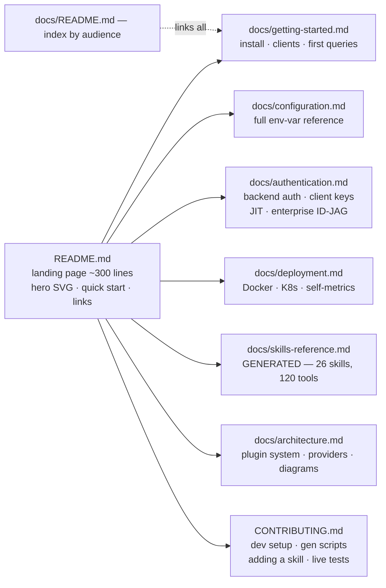

# Documentation Revamp Plan

**Status:** Proposed · 2026-07-16
**Owner:** Carlos Montero · **Executor:** Claude
**Scope:** All user-facing and contributor-facing documentation of `otel-mcp-server`

---

## 1. Why now

Early adopter feedback on the product is strong, but the docs describe a product two quarters old. The README — our npm and GitHub landing page — misstates the headline numbers, shows a v1.4.0 banner for a v1.8.0 product, carries March-era screenshots, and teaches contributors a skill-authoring workflow that no longer compiles. Docs are now the adoption bottleneck, not the code.

## 2. Audit findings (2026-07-16, three parallel audits)

### Ground truth (verified against `src/skills.generated.ts`, `docs/tool-contracts.json`, per-file registrations — three independent counts agree)

| Fact | Value |
|---|---|
| Version | **1.8.0** (+ unreleased enterprise-auth Phase 0: EdDSA, configurable jti cap) |
| Skills | **26** |
| Read tools (all backends configured) | **114** |
| Write tools (opt-in, `MCP_ENABLE_WRITES`) | **6** (5 Grafana + 1 AgentRelay) |
| Max tool surface | **120** |
| Default startup (no config) | **29 tools** across 6 always-on skills |
| HTTP endpoints | `/health`, `/metrics`, `/mcp`, `/auth/token` (+ `refresh`/`revoke`), 2× `/.well-known/*` (enterprise), CORS |
| CLI | `--http <port>` (port required), `--tools <csv>`; stdio default |

### README drift (1,247 lines, worst offenders)

| Severity | Finding |
|---|---|
| HIGH | Header says *24 skills / 106 tools*; Features says *110 tools / 25 skills* — **both wrong** (26 / 114+6) |
| HIGH | Grafana prose says "**three** write tools"; its own table lists **five** — undercounts the mutating surface (security-relevant) |
| MED | Architecture tree missing **14 real files** incl. `skills.generated.ts`, `vmalert.ts`, `public-exchange.ts`, `agentrelay.ts`; wrong per-file counts |
| MED | "Adding a new skill" instructs hand-editing `src/skills.ts` — registry is **generated** (`npm run gen:skills`); a contributor following it fails |
| MED | `BEYLA_` missing from auth-prefix list; `MCP_VERSION_GATING` absent from config tables; `KUBERNETES_INSECURE_SKIP_TLS_VERIFY` undocumented; `mcp_build_info` missing from metrics table |
| LOW | v1.4.0 startup banner; v1.2.0-era appendix "Live Cluster Analysis" (2026-03-24); 2026-03-24 screenshots; `mcp_server_info` typed "Info" (it's a gauge); `mcp_tool_errors_total` unlisted |
| — | **Correct and worth preserving:** all 26 per-skill tool tables, badges, JIT + enterprise-auth sections (README is even ahead of code docstrings) |

### Structural problems

- README is a monolith: landing page + full config reference + auth deep-dive + K8s manifests + stale showcase + **monorepo-subtree instructions that belong in the KrystalineX repo, not here**.
- `docs/` has no index; 4 of 6 hand-written docs are orphaned (unlinked from anywhere).
- `.env.example` documents 70 vars but **omits the entire JIT / enterprise-auth / version-gating / session-tuning / `MCP_BACKENDS` / AgentRelay surface**, and documents a dead `MCP_HTTP_PORT` that no code reads.
- No `CONTRIBUTING.md`, `SECURITY.md`, `CODE_OF_CONDUCT.md`, issue/PR templates.
- `CHANGELOG.md` jumps 1.6.0 → 1.7.1 (a `chore(release): 1.7.0` commit exists — verify and restore the entry).

### docs/ folder verdicts

| File | Verdict |
|---|---|
| `live-testing.md` | ✅ Keep — accurate, linked, load-bearing |
| `supported-versions.md/.json`, `tool-contracts.json`, `api-snapshot.json` | ✅ Keep — generated, current |
| `grafana-skill-analysis.md` | ✅ Keep, **rename** → `grafana-skill-reference.md` (it's a reference, not an analysis) |
| `studio-user-journeys.md` | ✅ Keep — positioning doc, tool names verified current; label as vision |
| `enterprise-auth-roadmap.md` | ✅ Keep, move → `docs/design/` (contributor/investor design note) |
| `integration-adapter-matrix.md` | ⚠️ **Rewrite or archive — Carlos's call.** Investor-facing OSS-per-layer doc, but self-contradictory ("no code changes yet" header vs "25 skills shipped" body), stale counts, and an eBPF-first build sequence that reality didn't follow (HTTP long-tail shipped first) |
| `sample*.png` (3) | 🔄 Replace — 2026-03-24, v1.2-era |
| `live-test-report-viewer.html` | ✅ Keep — companion tooling |

## 3. Target information architecture

Slim, audience-routed, with reference material generated from code wherever numbers can drift.

| Document | Content | Source |
|---|---|---|
| `README.md` (rewrite, ~300 lines) | Hero diagram + badges, value prop, quick start (npx / Claude Desktop / VS Code / HTTP / Docker), compact skills table, auth overview, links. Counts injected between gen-markers. | Salvage from current README |
| `docs/README.md` (new) | Index grouped by audience: adopter / operator / contributor / design | New |
| `docs/getting-started.md` (new) | Install paths, client wiring (Claude Desktop, Copilot, HTTP curl), first prompts, `--tools` selection | Extracted from README |
| `docs/configuration.md` (new) | Every env var: backend URLs, static auth suffixes, OAuth client-credentials, multi-backend/failover, `MCP_BACKENDS`, runtime knobs incl. `MCP_VERSION_GATING`, session tuning, K8s TLS vars | Extracted + gap-fill from code |
| `docs/authentication.md` (new) | The 1.8 auth story end-to-end: backend creds → client keys → JIT lifecycle → enterprise ID-JAG. Diagrams D3–D5. OWASP MCP Top 10 mapping. | Extracted (this content is accurate today) |
| `docs/deployment.md` (new) | Docker (multi-arch), K8s manifests + Secrets, probes, `/metrics` scraping, full self-metrics table (incl. `mcp_build_info`, JIT metrics, `mcp_tool_errors_total`) | Extracted + corrected |
| `docs/skills-reference.md` (new, **generated**) | Per-skill: description, enabling env var, tool tables, write tools, version support | `gen:docs` (WS-C) |
| `docs/architecture.md` (new) | Skill plugin model, generated registry pipeline, traces provider layer, accurate src tree, capability/version-gating model. Diagrams D1–D2, D6. | Rewritten from README + code |
| `CONTRIBUTING.md` (new) | Dev workflow, `gen:*` scripts, correct "adding a skill" (via `gen:skills`), unit + live tests, PR conventions, monorepo-subtree note relocated here | New + relocated |
| `SECURITY.md` (new) | Reporting, auth posture summary, read-only-by-default stance, secrets handling | New |
| `CHANGELOG.md` | Restore missing 1.7.0 entry (verify against git tag first) | Fix |
| `.env.example` | Add missing var groups; delete dead `MCP_HTTP_PORT` | Fix |

**Deleted/relocated from README:** monorepo-subtree appendix (→ CONTRIBUTING), "Live Cluster Analysis" appendix (→ replaced by fresh capture or dropped), full config tables (→ docs/), K8s manifest (→ docs/deployment.md).

**Not in scope (proposed):** a docs website (VitePress/GitHub Pages). The docs/ set is designed so a site can be added later without rework. Say the word if you want it now.

## 4. Graphics inventory

### Diagrams (mermaid source in docs; pre-rendered SVG in `docs/img/` for README, since npm doesn't render mermaid)

| ID | Diagram | Used in |
|---|---|---|
| D1 | System hero — clients (Claude Desktop/Copilot/custom) ↔ server (26 skills/120 tools/auth) ↔ backend groups | README + architecture |
| D2 | Skill plugin architecture — `gen:skills` → registry → per-skill tools; always-on vs URL-gated | architecture, CONTRIBUTING |
| D3 | Layered auth map — client keys / JIT / enterprise vs backend static / OAuth | authentication |
| D4 | JIT token lifecycle state diagram — mint → use → rotate (grace) → expire/revoke; TTL + lineage caps | authentication |
| D5 | Enterprise ID-JAG sequence — employee → IdP SSO → ID-JAG → token exchange → scoped session | authentication |
| D6 | Multi-backend instances + failover — named instances, ordered URL failover on 5xx/timeout | configuration, architecture |

### Screenshots / captures

| ID | Capture | Method |
|---|---|---|
| S1 | HTTP startup banner showing v1.8.0 + 26-skill listing | Local run, terminal-styled SVG from real output (regenerable) |
| S2 | Agent session: "what's running, what's healthy?" against the Docker fixture stack | Live-test stack + real agent session — **needs decision: local fixture capture (me) vs production-cluster capture (Carlos)** |
| S3 | JIT badge flow — mint/call/rotate/revoke curl session | Local run, terminal-styled SVG |
| S4 | Live-test report viewer | Browser screenshot of real report |
| S5 | Claude Desktop showing otel tools loaded + a real trace answer | **Carlos** — real client + real data beats anything synthetic |

## 5. Drift prevention (the durable fix)

The audit's root cause: hand-maintained numbers in prose. Fix it structurally:

1. **`gen:docs`** (new script, pattern-matched to existing `gen:*`): renders `docs/skills-reference.md` from the skill registry + `tool-contracts.json` — the same tables the README carries today, but never hand-edited again.
2. **Marker injection in README:** `<!-- gen:counts -->26 skills · 114 tools (+6 write-gated)<!-- /gen:counts -->` rewritten by `gen:docs`, so the landing page can never disagree with the registry.
3. **Drift guard test** (pattern: existing `skill-registry-generated.test.ts`): CI fails when `docs/skills-reference.md` or README markers are stale.
4. Version strings in examples sourced from `src/version.ts` at generation time.

## 6. Delivery plan

Branch `docs/revamp` off `develop` (CI badges and dependabot target `develop`; confirm PR base). Sequenced for reviewability:

| PR | Content | Size |
|---|---|---|
| PR-1 | **Accuracy hotfix** — wrong counts, "three→five write tools", missing env vars in tables, `.env.example` gaps, CHANGELOG 1.7.0. No restructuring — safe to ship immediately, fixes the actively-misleading npm page on next release | S |
| PR-2 | **Restructure** — new docs/ set, slim README, CONTRIBUTING/SECURITY, index, renames/moves | L |
| PR-3 | **Generated reference + CI guard** (WS-C) | M |
| PR-4 | **Graphics** — diagrams D1–D6, captures S1–S4 | M |

## 7. Division of labor

**Claude (autonomous):** everything in PR-1…PR-4 except the items below — audits are done, all content sources identified, Docker fixture stack available locally for captures.

**Carlos:**
1. **Decision — `integration-adapter-matrix.md`:** refresh as the living investor-facing roadmap (I update counts/status, you re-anchor the eBPF-first narrative) or archive to `docs/design/` with a dated banner. It's your investor artifact — your call.
2. **Decision — S2 hero screenshot:** fixture-stack capture (fully reproducible, modest data) vs your production KrystalineX cluster capture (impressive, real). The old samples were production-flavored.
3. **S5:** a real Claude Desktop screenshot with your environment.
4. **Review/merge** the four PRs; releases publish the fixed README to npm.
5. Optional: logo/wordmark for the README hero if you want brand polish this pass.

## 8. Open questions

1. PR base branch: `develop` (default per remote HEAD) — confirm, since the session's git context names `main` as PR target.
2. Keep the "Studio" journeys doc linked from the README hero section, or move the link into docs index only?
3. Appendix "Live Cluster Analysis": drop entirely, or replace with a fresh capture once S2 is decided?
