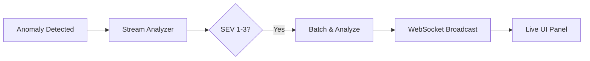
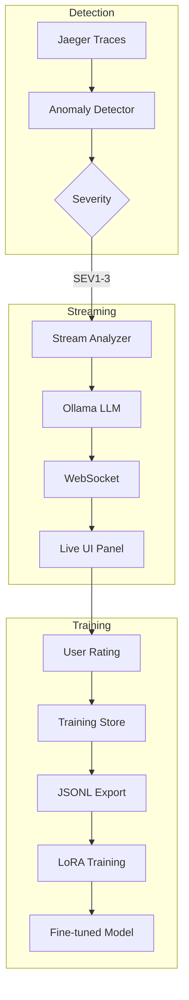

# LLM Monitoring & Fine-Tuning Walkthrough

## Overview

This session implemented real-time streaming LLM analysis and a complete fine-tuning infrastructure for the anomaly detection system.

---

## Features Implemented

### 1. Real-Time Streaming Analysis

**Live Analysis Panel** showing streaming LLM responses:



**Key Files:**
- [ws-server.ts](file:///c:/Users/bizai/Documents/GitHub/OtelE2E/server/monitor/ws-server.ts) - WebSocket server
- [stream-analyzer.ts](file:///c:/Users/bizai/Documents/GitHub/OtelE2E/server/monitor/stream-analyzer.ts) - Batching + streaming

**Features:**
- 30-second batch window
- 8 use-case detection patterns (P0/P1/P2)
- Streaming tokens to UI
- Auto-reconnecting WebSocket client

---

### 2. Training Data Collection

**UI Components:**
- 👍 Good / 👎 Bad rating buttons
- Correction modal for bad responses
- Training stats badge

**Data Flow:**
```
Analyze → User Rates → Store to JSON → Export JSONL
```

**API Endpoints:**
| Endpoint | Purpose |
|----------|---------|
| `POST /training/rate` | Submit rating |
| `GET /training/stats` | View statistics |
| `GET /training/export` | Download JSONL |

**Export Format (for bad examples):**
```json
{
  "prompt": "[full LLM prompt]",
  "completion": "[user's correction]",
  "original_completion": "[LLM's wrong response]",
  "rating": "bad"
}
```

---

### 3. Fine-Tuning Pipeline

**Key Files:**

| File | Purpose |
|------|---------|
| [04_FINE_TUNING.md](file:///c:/Users/bizai/Documents/GitHub/KrystalineX/docs/observability/04_FINE_TUNING.md) | Step-by-step guide |
| [generate-synthetic-training.cjs](file:///c:/Users/bizai/Documents/GitHub/KrystalineX/scripts/generate-synthetic-training.cjs) | Synthetic data generator (100+ samples) |
| [validate-training-data.cjs](file:///c:/Users/bizai/Documents/GitHub/KrystalineX/scripts/validate-training-data.cjs) | Dataset validation script |
| [generate-training-data.py](file:///c:/Users/bizai/Documents/GitHub/KrystalineX/scripts/generate-training-data.py) | Hand-crafted real examples (22 samples) |
| [axolotl-config.yaml](file:///c:/Users/bizai/Documents/GitHub/KrystalineX/axolotl-config.yaml) | LoRA training config |
| [retrain-model.sh](file:///c:/Users/bizai/Documents/GitHub/KrystalineX/scripts/retrain-model.sh) | Training pipeline script |

**Training Stack:**
- **Axolotl** for LoRA fine-tuning
- **Llama 3.2 1B** as base model
- **GGUF export** for Ollama deployment

---

## Architecture Summary



---

## Quick Commands

```bash
# View training stats
curl http://localhost:5000/api/v1/monitor/training/stats

# Export training data from running app
curl http://localhost:5000/api/v1/monitor/training/export > training-data-export.jsonl

# Generate synthetic training data (100 samples) and merge with real data
node scripts/generate-synthetic-training.cjs --count 100

# Validate combined dataset
node scripts/validate-training-data.cjs

# Run training pipeline
./scripts/retrain-model.sh
```

---

## Configuration

| Setting | Value | File |
|---------|-------|------|
| Batch timeout | 30 seconds | `stream-analyzer.ts` |
| LLM Model | llama3.2:1b | `analysis-service.ts` |
| Repeat penalty | 1.3 | `stream-analyzer.ts` |
| LoRA rank | 16 | `axolotl-config.yaml` |
