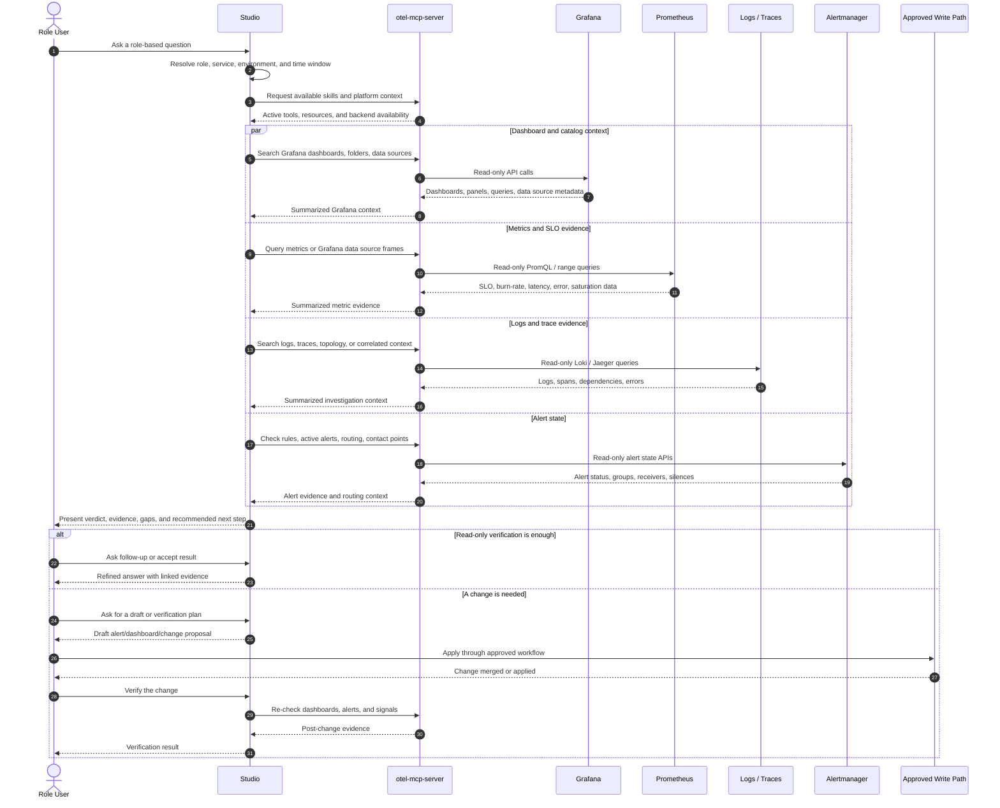

# Studio User Journeys by Role

Date: 2026-05-20

This document describes how different roles use the Studio to interrogate the observability platform, verify operational state, and move from question to evidence-backed action. The Studio is assumed to sit on top of the MCP server capabilities in this repository: traces, metrics, logs, Grafana, Alertmanager, Elasticsearch, ZK proofs, and system health.

The Grafana integration is read-only. For write-oriented tasks such as adding alerts or changing dashboards, the Studio should help users investigate, validate, draft, and verify. The actual change should happen through the approved write path, such as Grafana UI, Terraform, Jsonnet, Helm values, or a pull request.

## Common Studio Pattern

Every role follows the same basic loop:

1. Ask a goal-oriented question in business or platform language.
2. Studio identifies the service, environment, time window, data source, dashboard, alert, or ownership context.
3. Studio gathers evidence using read-only tools.
4. Studio summarizes findings with confidence, gaps, and links back to relevant dashboards, alerts, traces, logs, or queries.
5. User decides whether to observe, investigate, escalate, or make a change through an approved workflow.
6. Studio verifies the outcome after the change lands.

## Studio Interaction Sequence



## Role Journey Matrix

| Role | Primary Goal | Typical Starting Question | Studio Outcome |
| --- | --- | --- | --- |
| Service Owner | Understand whether a service is meeting reliability goals | "Is checkout within SLO this week?" | SLO status, burn rate, active risks, linked evidence, suggested next checks |
| Platform Engineer | Add or tune platform guardrails safely | "Help me add an alert for stale GT7 telemetry" | Existing-rule check, metric validation, alert draft, routing verification, post-change verification steps |
| Platform User | Discover what is available for self-service | "What can I use without opening a ticket?" | Available data sources, dashboards, tools, templates, permissions, and request paths |
| On-call Engineer | Triage live incidents quickly | "What is unhealthy right now?" | Current alerts, target health, correlated traces/logs/metrics, likely blast radius |
| Engineering Manager | Review operational posture | "Are teams staying inside error budget?" | SLO summary, unresolved alerts, recurring risks, service-level trends |

## Service Owner Journey: Check SLO Compliance

### Persona

The Service Owner is accountable for customer-facing reliability of one or more services. They may not know every PromQL expression, dashboard UID, or alert rule, but they know the service name, user journey, and target reliability.

### Trigger

- Weekly reliability review.
- Release readiness check.
- Customer impact question.
- Alert about burn-rate or latency-budget exhaustion.

### User Starts With

```text
Check SLO compliance for checkout over the last 7 days.
```

Other useful prompts:

```text
Is the exchange service inside its latency SLO today?
Show me what is consuming error budget for kx-exchange.
Are there active alerts or dashboard signals that put my service at risk?
```

### Studio Flow

1. Resolve service context.

   Studio identifies the service name, namespace, dashboard tags, Grafana folder, Prometheus labels, and relevant SLO windows.

2. Find dashboards and panel queries.

   Studio searches Grafana dashboards and extracts panel queries so the Service Owner can see which signals are already curated.

   Useful tools:

   - `grafana_dashboards_search`
   - `grafana_dashboard_get`
   - `grafana_datasources`

3. Query SLO and error-budget indicators.

   Studio queries Prometheus or Grafana data source frames for availability, latency, error rate, burn rate, request volume, and saturation.

   Useful tools:

   - `metrics_query`
   - `metrics_query_range`
   - `grafana_datasource_query`
   - `metrics_metadata`
   - `metrics_label_values`

4. Check active risk.

   Studio checks alert state and routing status.

   Useful tools:

   - `metrics_alerts`
   - `grafana_alert_rules`
   - `grafana_alerts`
   - `alertmanager_alerts`
   - `alertmanager_groups`

5. Explain the result.

   Studio returns a concise SLO verdict:

   - Current compliance status.
   - Error budget remaining.
   - Burn-rate trend.
   - Top contributing signals.
   - Whether alerts are firing, pending, inactive, silenced, or missing.
   - Links or names of dashboards and panels used as evidence.

6. Recommend next investigation.

   If SLO is at risk, Studio pivots into traces, logs, and topology.

   Useful tools:

   - `traces_search`
   - `trace_get`
   - `logs_query`
   - `logs_tail_context`
   - `system_topology`

### Expected Output

```text
SLO verdict: At risk, not currently breached.

Evidence:
- Availability remains inside target for the selected window.
- Latency burn rate is elevated over the last 6 hours.
- One warning alert is active: LatencyBudgetExhaustion.
- Dashboard "Service SLO Overview" contains the matching burn-rate panel.

Recommended next step:
Investigate slow traces for kx-exchange and compare p95/p99 latency before and after the latest deployment.
```

### Success Criteria

- The Service Owner can answer whether the service is compliant, at risk, or breaching.
- The answer includes evidence, not just a status label.
- The Service Owner has a clear next step if the SLO is at risk.

## Platform Engineer Journey: Add or Tune an Alert

### Persona

The Platform Engineer owns shared observability guardrails. They define alerting standards, route alerts, prevent duplicates, and ensure alerts are actionable.

### Trigger

- A new service needs alert coverage.
- A noisy alert needs tuning.
- A missing alert was discovered during an incident.
- A dashboard panel exposes a useful signal that should become an alert.

### User Starts With

```text
Help me add an alert when GT7 telemetry data is stale for more than 30 seconds.
```

Other useful prompts:

```text
Do we already have an alert for stale telemetry?
Find the best PromQL signal for GT7 data freshness.
Draft an alert rule for high p99 latency on checkout.
Verify the new alert is visible and routed after I add it.
```

### Studio Flow

1. Clarify alert intent.

   Studio identifies the symptom, affected service, environment, severity, time threshold, notification route, and owner.

2. Discover existing rules.

   Studio checks Prometheus, Grafana, and Alertmanager for existing rules or active alerts that may already cover the condition.

   Useful tools:

   - `metrics_alerts`
   - `grafana_alert_rules`
   - `grafana_alerts`
   - `alertmanager_alerts`

3. Validate the signal.

   Studio finds candidate metrics and confirms label names, units, cardinality, and current behavior.

   Useful tools:

   - `metrics_metadata`
   - `metrics_label_values`
   - `metrics_query`
   - `metrics_query_range`
   - `grafana_datasource_query`

4. Cross-check dashboards.

   Studio searches Grafana for dashboards and panels already using the metric, then extracts the panel PromQL.

   Useful tools:

   - `grafana_dashboards_search`
   - `grafana_dashboard_get`

5. Draft the alert.

   Studio produces a read-only draft with:

   - Alert name.
   - PromQL expression.
   - Duration.
   - Severity.
   - Labels.
   - Annotations.
   - Runbook link placeholder.
   - Suggested dashboard and panel references.
   - Routing/contact point recommendation.

6. Hand off to approved write path.

   Studio does not create the alert directly. The Platform Engineer applies the change through Grafana UI or IaC.

7. Verify after creation.

   Studio checks that the rule exists, evaluates correctly, and is routed as expected.

   Useful tools:

   - `grafana_alert_rules`
   - `grafana_contact_points`
   - `alertmanager_groups`
   - `metrics_alerts`

### Expected Output

```yaml
alert: GT7TelemetryStale
expr: gt7_data_age_seconds > 30
for: 2m
labels:
  severity: warning
  service: gt7
  team: racing-platform
annotations:
  summary: GT7 telemetry data is stale
  description: No fresh GT7 telemetry has been observed for more than 30 seconds.
  dashboard: GT7 Pit Wall v2
  runbook: TODO
```

### Success Criteria

- The alert is not a duplicate.
- The expression is validated against live data.
- The rule has clear ownership, severity, and action guidance.
- Routing/contact point assumptions are verified.
- The final alert is verified read-only after it is created.

## Platform User Journey: Discover Self-Service Capabilities

### Persona

The Platform User is an application developer, product engineer, data consumer, or team member who wants to know what they can use without waiting for a platform ticket.

### Trigger

- New team onboarding.
- A developer wants dashboards or metrics for a service.
- A user wants to know which tools, data sources, or workflows are available.
- A user wants to understand what requires platform approval.

### User Starts With

```text
What can I do in the Studio without opening a ticket?
```

Other useful prompts:

```text
What dashboards are available for GT7?
Which data sources can I query?
What labels can I use to find my service metrics?
What alerts or dashboards already exist for my service?
```

### Studio Flow

1. Show available capabilities.

   Studio summarizes active skills and tools, configured backends, and the current platform overview.

   Useful surfaces:

   - `otel://overview`
   - `/health` in HTTP mode
   - `grafana_health`
   - `grafana_datasources`

2. Show available dashboards and folders.

   Studio lists dashboards, folders, tags, and dashboard URLs that match the user context.

   Useful tools:

   - `grafana_folders`
   - `grafana_dashboards_search`
   - `grafana_dashboard_get`

3. Show available metrics and labels.

   Studio helps the user discover metric names, labels, values, and safe query examples.

   Useful tools:

   - `metrics_label_values`
   - `metrics_metadata`
   - `metrics_query`

4. Show available logs and traces.

   Studio helps users find trace services, operations, Loki labels, and service-related logs.

   Useful tools:

   - `traces_services`
   - `traces_operations`
   - `logs_labels`
   - `logs_label_values`

5. Explain boundaries.

   Studio clearly distinguishes between self-service read-only actions and changes that need approval.

   Self-service examples:

   - Search dashboards.
   - Query metrics/logs/traces.
   - Check data source health.
   - Check active alerts.
   - Generate investigation summaries.

   Approval-path examples:

   - Add or edit dashboards.
   - Add or edit alerts.
   - Change contact points or routing.
   - Grant permissions.
   - Change data source configuration.

### Expected Output

```text
You can self-serve these workflows now:

- Browse Grafana folders and dashboards.
- Query the Prometheus data source through Grafana.
- Discover Prometheus labels and metric metadata.
- Search traces by service and operation.
- Query Loki logs by label.
- Check current alert state.

Changes such as creating alerts or dashboards require the approved platform change path.
```

### Success Criteria

- The user understands what is available immediately.
- The user knows which prompts to use next.
- The user knows which actions require approval.
- The user has a clear request path for missing access or missing resources.

## On-call Engineer Journey: Triage a Live Issue

### Persona

The On-call Engineer needs to quickly identify current impact, likely cause, and blast radius.

### User Starts With

```text
What is unhealthy right now, and what changed recently?
```

### Studio Flow

1. Check current alerts and target health.
2. Identify affected services and dependencies.
3. Pull recent traces, logs, and metrics for the affected service.
4. Check whether dashboards already show the same symptom.
5. Summarize blast radius, likely cause, and immediate next step.

Useful tools:

- `system_health`
- `system_topology`
- `metrics_targets`
- `metrics_alerts`
- `alertmanager_alerts`
- `grafana_alerts`
- `traces_search`
- `logs_query`

## Engineering Manager Journey: Review Reliability Posture

### Persona

The Engineering Manager wants a roll-up of operational risk, reliability trends, and repeated failure modes.

### User Starts With

```text
Summarize reliability posture for the platform this week.
```

### Studio Flow

1. Summarize active and recent alerts by team/service.
2. Summarize SLO or burn-rate risk by service.
3. Identify dashboards and alerts that need ownership cleanup.
4. Highlight recurring traces/log patterns or noisy alert groups.
5. Produce a human-readable status report with evidence links.

Useful tools:

- `metrics_query`
- `metrics_alerts`
- `grafana_alert_rules`
- `grafana_dashboards_search`
- `alertmanager_groups`
- `system_health`

## Prompt Starters by Role

| Role | Prompt Starter |
| --- | --- |
| Service Owner | "Check SLO compliance for `<service>` over `<window>`." |
| Service Owner | "Show the top signals consuming error budget for `<service>`." |
| Platform Engineer | "Do we already alert on `<condition>` for `<service>`?" |
| Platform Engineer | "Draft a read-only alert proposal for `<metric>` crossing `<threshold>`." |
| Platform User | "What dashboards, metrics, logs, and traces are available for `<service>`?" |
| Platform User | "What can I self-serve in this environment?" |
| On-call Engineer | "What is unhealthy right now?" |
| Engineering Manager | "Summarize reliability posture for `<team>` this week." |

## Studio Guardrails

- Default to read-only interrogation.
- Prefer existing dashboards and alert rules before proposing new ones.
- Show exact query expressions when they support a recommendation.
- Redact secrets and secure data source fields.
- Cap large dashboard, log, trace, and query responses.
- Call out missing data or permissions explicitly.
- For changes, draft the intent and verification plan, then hand off to the approved write path.
- After a change lands, verify it using read-only checks.